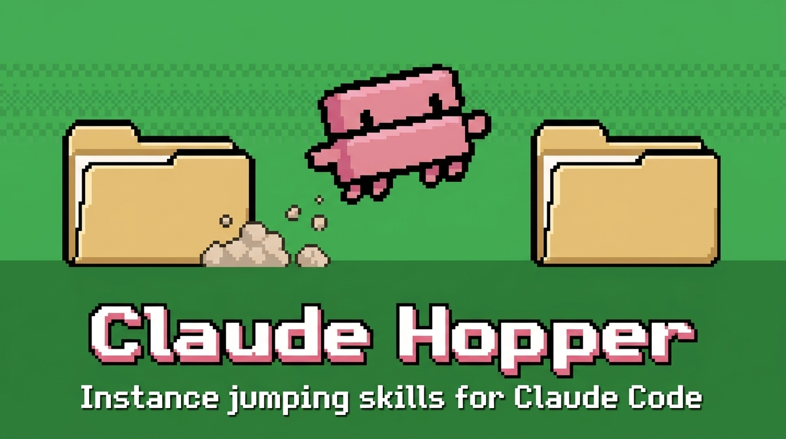

[](https://claude.danielrosehill.com/)
[](https://github.com/danielrosehill/Claude-Code-Repos-Index)
[](https://github.com/danielrosehill/Github-Master-Index)

🌐 **Browse the full Claude Code Projects Index at [claude.danielrosehill.com](https://claude.danielrosehill.com/)** — searchable catalog of all plugins, skills, and Claude Code projects.

A comprehensive marketplace of Claude Code plugins for developers, system administrators, content creators, and productivity enthusiasts. These plugins extend Claude Code with specialized slash commands and agents for various workflows.

📋 **[View Plugin Source Repositories](planning/sources.md)** - Complete list of all plugin repositories with links

## Available Plugins


### AI & Context

#### AI Engineering

Claude Code plugin: prompt engineering workflow — craft, eval, catalog, version, search prompts, with library/factory variants.

[](https://github.com/danielrosehill/Claude-AI-Engineering-Plugin)

```
/plugin install ai-engineering@danielrosehill
```

---

#### Claude User Memory

Backend-agnostic persistent user memory for Claude Code. Ships a save/recall/commit contract with personal/work context routing; bring your own memory MCP (Pinecone, Mem0, or other) via a workspace memory-config.md.

[](https://github.com/danielrosehill/Claude-User-Memory-Plugin)

```
/plugin install claude-user-memory@danielrosehill
```

---

#### Personal Context

Builds and maintains a persistent, portable background context layer about the user — intake interview, ingestion of material they already have, gap analysis, scoped retrieval, maintenance and export. Plain markdown entries in a store the user owns, read through declared scopes and sensitivity levels; explicitly does not use model-managed memory. Ships the Portable Context Contract so issue-scoped workspaces can read it without re-asking who the person is. Complements `claude-user-memory`: that one holds operational facts in a memory backend, this one holds biographical context as files.

[](https://github.com/danielrosehill/Claude-Personal-Context-Plugin)

```
/plugin install personal-context@danielrosehill
```

---

#### AI Model Research

Research, discover, compare, and evaluate AI models on OpenRouter — backed by the bundled Model-Scout MCP server for live catalog data with caching. 11 skills cover lookup, capability filtering, recommendation, comparison, deep evaluation, workload cost projection, and finding cheaper alternatives. Subsumes the previous `open-router-model-research` plugin and the standalone `Model-Scout-MCP` server.

[](https://github.com/danielrosehill/Claude-AI-Model-Research-Plugin)

```
/plugin install ai-model-research@danielrosehill
```

---

#### User-Claude-MD

Manage the user-level ~/.claude/CLAUDE.md and its chunked ~/.claude/context/ directory — audit, chunk, list, and edit global Claude Code user context for token efficiency.

[](https://github.com/danielrosehill/User-Claude-MD-Plugin)

```
/plugin install user-claude-md@danielrosehill
```

---

#### Claude SOPs

Keep your own standard operating procedures — the recurring things you do a particular way — as a private, versioned library of markdown files the agent reads on demand and follows. One delimited block in your CLAUDE.md points at the library; a generated INDEX.md carries a "use when" trigger per procedure; exactly one file is read once a situation matches, so forty procedures cost one table to consult rather than forty resident skill descriptions. Skills for setup, run, write, edit, list, retire and sync. Procedures live in `~/.claude-user-data/sops/` as flat readable files in a private git repo mirrored across machines — never in the plugin repo. (For authoring printed SOP documents for other people, see `sop-writer` under Documentation & Writing; these are procedures an agent executes.)

[](https://github.com/danielrosehill/Claude-SOPs)

```
/plugin install claude-sops@danielrosehill
```

---

#### LLM Council Creator

Scaffold new LLM Council projects from existing templates (Template, Grounded, Decide) or build bespoke council repos for specific purposes.

[](https://github.com/danielrosehill/Claude-LLM-Council-Creator-Plugin)

```
/plugin install LLM-Council-Creator@danielrosehill
```

---

#### Get Toony

Convert JSON, CSV, YAML, and CLAUDE.md trees into TOON (Token-Oriented Object Notation) — a compact, lossless re-encoding that uses ~40% fewer tokens than JSON when fed to LLMs. Wraps `@toon-format/toon` and tracks the wider TOON ecosystem (Python, Java, .NET, PHP, Rust ports).

[](https://github.com/danielrosehill/Claude-Get-Toony-Plugin)

```
/plugin install get-toony@danielrosehill
```

### Git & GitHub

#### Claude Code Feedback

File well-formed bug reports, feature requests, model-behavior reports, and documentation issues against anthropics/claude-code. Fetches the live issue templates, gathers required fields, and submits via gh CLI.

[](https://github.com/danielrosehill/Claude-Code-Feedback)

```
/plugin install claude-code-feedback@danielrosehill
```

---

#### Github Explorer

Semantic GitHub repo discovery for reusable components. Search, rank, overview, evaluate, and recommend open-source repos — Claude parses gh API results, weighing stars, activity, maintenance, license, and stack fit.

[](https://github.com/danielrosehill/Claude-Github-Explorer-Plugin)

```
/plugin install github-explorer@danielrosehill
```

---

#### Gist Writer

Write content to GitHub gists (public or private) via the gh CLI.

[](https://github.com/danielrosehill/Claude-Gist-Writer-Plugin)

```
/plugin install gist-writer@danielrosehill
```

### Repo Scaffolding & Retrofitting

#### Dev Tools

Claude Code plugin: dev tools workflow — scaffold repos, QA code review, templatize, session continuity. Retrofit-* and janitor-* skills moved to the repo-mgmt plugin in 2.0.0.

[](https://github.com/danielrosehill/Claude-Dev-Tools-Plugin)

```
/plugin install dev-tools@danielrosehill
```

---

#### Repo Mgmt

Repository management toolkit: organise and dedupe local repos, retrofit codebases with AI agent primitives, janitor-style cleanup, convert to Claude plugins, spin off breakaway or parallel-private repos; scan for dead remotes, missing clones, visibility risks, stale archive candidates, and PII leaks (gitleaks + Presidio with personal-inventory matching); bulk git ops across folders of clones. Includes a preferences layer that remembers where different repo types live on disk.

[](https://github.com/danielrosehill/Claude-Repo-Mgmt-Plugin)

```
/plugin install repo-mgmt@danielrosehill
```

---

#### Workspace Foundational

Claude Code plugin: foundational workspace workflow — setup, context management, report parsing, inventory, template discovery, with 6 variants.

[](https://github.com/danielrosehill/Claude-Workspace-Foundational-Plugin)

```
/plugin install workspace-foundational@danielrosehill
```

---

#### Task Queuer

Repo-based task queueing system with categorisation and prioritisation. Scaffolds a planning/ folder, logs tasks (single, batch list, or voice-transcribed), buckets them by category, and hands prioritised work off to the repo's orchestration agent.

[](https://github.com/danielrosehill/Claude-Task-Queuer-Plugin)

```
/plugin install task-queuer@danielrosehill
```

---

#### Favorite Plugins Installers

Curated batches of third-party Claude Code plugins, grouped by type/theme, installable in one command.

[](https://github.com/danielrosehill/Claude-Favorite-Plugins-Installers-Plugin)

```
/plugin install favorite-plugins-installers@danielrosehill
```

---

#### Spec Starter

Spec-driven development workflow for Claude Code: turn unstructured project briefs (especially voice transcripts) into a versioned spec, modular context, and a CLAUDE.md scaffolded into your current repo.

[](https://github.com/danielrosehill/spec-starter-plugin)

```
/plugin install spec-starter@danielrosehill
```

---

#### Dev Debugger

Bug-ticket workflow for development repos — capture bugs into `planning/bugs/`, dispatch specialist remediation agents (reproducer, diagnoser, patcher, fix-documenter), document fixes, and ship releases.

[](https://github.com/danielrosehill/dev-debugger-plugin)

```
/plugin install dev-debugger@danielrosehill
```

---

#### License Populator

Recommend, generate, and populate software/content licenses. Reads from a user-managed template store and advises on optimal license choice given desired freedoms and constraints.

[](https://github.com/danielrosehill/Claude-License-Populator-Plugin)

```
/plugin install license-populator@danielrosehill
```

---

#### Userscript Development

Develop, test, and publish Tampermonkey userscripts — scaffold `.user.js` files with proper metadata blocks, validate behavior live in Chrome via the Claude in Chrome MCP, generate READMEs, and bump versions for auto-update.

[](https://github.com/danielrosehill/Claude-Userscript-Development-Plugin)

```
/plugin install userscript-development@danielrosehill
```

---

#### Stack Evaluator

Review a project's stack rather than its code — record the components to `docs/stack/` with the run date, check each for end-of-life and currency, find what is architecturally absent (caching at all five layers, backups, queues, rate limiting, observability), flag redundancy and over-engineering against the actual workload, then emit a sequenced revision proposal and a self-contained execution brief. Re-runnable per repo: settled decisions are not re-raised and chronic findings show their age.

[](https://github.com/danielrosehill/stack-evaluator-plugin)

```
/plugin install stack-evaluator@danielrosehill
```

### QA & Agent Sessions



#### Claude Hopper

Skills for hopping between discrete terminal-bound Claude Code sessions on Linux. Spawn new instances (Konsole), hand off context (full / clipboard / with-tasks), resume from handovers, and pick up leftover work.

[](https://github.com/danielrosehill/Claude-Hopper)

```
/plugin install claude-hopper@danielrosehill
```

---

#### Claude Rudder

Claude-Rudder — collection of utilities to smoothen Claude Code UX. Context-gate workflow, log/blocker capture, plugin/MCP primitives, repo & docs spawning, and the canonical user-data storage convention. (Session-hopping skills moved to Claude-Hopper.)

[](https://github.com/danielrosehill/Claude-Rudder)

```
/plugin install claude-rudder@danielrosehill
```

---

#### Claude Breakout

Route an idea that surfaces mid-task but does not belong to the current repository into its own repo and its own agent, without derailing the work in flight. Uses the cross-session SendMessage/ListAgents layer for a push-model handoff — the seed brief is written to disk in the new repo, and the message carries a pointer to it. Companion to `interrupt-claude` (same-repo interruption routing) and `claude-hopper` (session spawning and handover); breakout splits tracks rather than work or time. WIP.

[](https://github.com/danielrosehill/Claude-Breakout)

```
/plugin install breakout-claude@danielrosehill
```

### Documentation & Writing

#### Programmatic Doc Generation

Build programmatic document generation pipelines — Typst templates for local batch rendering, plus integration scaffolding for n8n and cloud rendering services (Carbone, PDFMonkey, APITemplate, DocRaptor, Docmosis, Adobe Doc Gen).

[](https://github.com/danielrosehill/Claude-Programmatic-Doc-Generation-Plugin)

```
/plugin install programmatic-doc-generation@danielrosehill
```

---

#### Repo To Content

Convert GitHub repos into polished content (PDF, white paper, internal doc, public-docs publication) via Typst, with optional AI banner generation and multi-target publishing.

[](https://github.com/danielrosehill/Claude-Repo-To-Content-Plugin)

```
/plugin install repo-to-content@danielrosehill
```

---

#### AI Attribution

Claude Code plugin: AI transparency workflow — document human vs AI contributions, add attribution, audit provenance.

[](https://github.com/danielrosehill/Claude-AI-Attribution-Plugin)

```
/plugin install ai-attribution@danielrosehill
```

---

#### Technical Docs

Claude Code plugin: technical documentation workflow — READMEs, reference docs, changelogs, environment docs, with api-reference/code-docs/environment-docs/dev-notebook variants.

[](https://github.com/danielrosehill/Claude-Technical-Docs-Plugin)

```
/plugin install technical-docs@danielrosehill
```

---

#### Content Writing

Claude Code plugin: content writing workflow — draft, proofread, version, publish, style guides, with writing/blog/opinion/document variants.

[](https://github.com/danielrosehill/Claude-Content-Writing-Plugin)

```
/plugin install content-writing@danielrosehill
```

---

#### Novelty Text Editor

Rewrite text in deliberately ridiculous styles — Shakespearean, medieval, archaic, chaos-case, over-salesy, platitude-stuffed, pseudobot, plus length transforms (elongate / truncate). Nine no-config skills for stylistic mischief.

[](https://github.com/danielrosehill/Claude-Novelty-Text-Editor-Plugin)

```
/plugin install novelty-text-editor@danielrosehill
```

---

#### SOP Writer

Project-scoped authoring tools for Standard Operating Procedures and decision flowcharts. Scaffold from templates, embed Mermaid/D2 diagrams, compile to printable PDFs via Typst, and assemble multi-document binders with TOC and page numbers.

[](https://github.com/danielrosehill/Claude-SOP-Writer-Plugin)

```
/plugin install sop-writer@danielrosehill
```

---

#### HTML Email Designer

Design and build responsive HTML email templates using Foundation for Emails, Maizzle, or MJML. Framework-agnostic authoring with email-client compatibility baked in.

[](https://github.com/danielrosehill/Claude-HTML-Email-Designer-Plugin)

```
/plugin install html-email-designer@danielrosehill
```

---

#### Resume Typesetter

Manage a resume as JSON Resume schema data and render it with custom Typst templates. Onboard, iterate, fork variants, and version.

[](https://github.com/danielrosehill/Claude-Resume-Typesetter-Plugin)

```
/plugin install resume-typesetter@danielrosehill
```

---

#### Digital Printing

Skills and an orchestrator agent for preparing PDFs for digital printing — resize, grayscale, font embedding, transparency flattening, image downsampling, color normalization, watermarks, footer burn-ins, cover pages, bleed-safety check, job folders, formal print orders, and email/Drive share.

[](https://github.com/danielrosehill/Claude-Digital-Printing-Plugin)

```
/plugin install digital-printing@danielrosehill
```

---

#### Document To Markdown

Convert PDFs to clean Markdown, chunk into logical sections (chapters, indexes, appendices), and extract embedded tables to CSV. Local-first via marker/docling/pymupdf4llm + camelot/tabula, with TOON manifests.

[](https://github.com/danielrosehill/document-to-markdown-plugin)

```
/plugin install document-to-markdown@danielrosehill
```

### Media Editing

#### Visual Communications

Plan and prompt-engineer AI-generated visuals (images, diagrams, video) for whitepapers, blog posts, and long-form content. Six skills cover project onboarding, visual ideation, prompt generation, project listing, fal-ai execution, and a resolution/style reference.

[](https://github.com/danielrosehill/Claude-Visual-Communications-Plugin)

```
/plugin install visual-communications@danielrosehill
```

---

#### Nano-Tech-Diagrams

Generate, transform, and clean up tech diagrams and whiteboard photos via the Nano Banana 2 model (Fal AI). Wraps the `nano-tech-diagrams` MCP server with seven skills (text-to-image, image-to-image, whiteboard cleanup, style/type listing, vendored prompt library, full whiteboard-to-publishable orchestrator) across 5 diagram families and 28+ visual styles.

[](https://github.com/danielrosehill/Nano-Tech-Diagrams-Plugin)

```
/plugin install nano-tech-diagrams@danielrosehill
```

---

#### GIMP

Bare-bones GIMP CLI wrapper for Linux: detect install (native/Flatpak/Snap/AppImage), persist a per-user profile, run Script-Fu batch ops, export images, install/list GIMP-side plugins.

[](https://github.com/danielrosehill/Claude-GIMP-Plugin)

```
/plugin install gimp@danielrosehill
```

---

#### Audio Production

Claude Code plugin: audio production workflow — normalize, VAD, transcribe, diarize, podcast assembly, with engineering/podcast/transcript variants.

[](https://github.com/danielrosehill/Claude-Audio-Production-Plugin)

```
/plugin install audio-production@danielrosehill
```

---

#### Claude Transcription

Claude Code plugin: audio transcription workflow — denoise, VAD, transcribe (Gemini/AssemblyAI/Whisper), clean, structure, export, with cloud and local engine backends.

[](https://github.com/danielrosehill/Claude-Transcription-Plugin)

```
/plugin install claude-transcription@danielrosehill
```

---

#### Image Production

Claude Code plugin: image production — editing, format conversion, batch ops, and filesystem organisation by resolution, aspect ratio, orientation, format, EXIF time, camera, plus dedupe and metadata scrubbing.

[](https://github.com/danielrosehill/Claude-Image-Production-Plugin)

```
/plugin install image-production@danielrosehill
```

---

#### Image Annotation

Capture screenshots and apply annotations (arrows, callouts, boxes, highlights, blur/redaction) on Linux via Pillow + ImageMagick, with batch WebP conversion and PDF bundling. Originals are never modified.

[](https://github.com/danielrosehill/Claude-Image-Annotation-Plugin)

```
/plugin install image-annotation@danielrosehill
```

---

#### Hardware ID & Annotation

Identify and annotate hardware components from photos — circuit boards, motherboards, ICs — with overlays, datasheet cross-checks, and structured BOMs.

[](https://github.com/danielrosehill/Claude-Hardware-ID-Annotation-Plugin)

```
/plugin install hardware-id-annotation@danielrosehill
```

---

#### Background Removal

Remove image backgrounds via rembg — single-pass, two-pass cleanup, batch mode, and KDE Dolphin right-click integration.

[](https://github.com/danielrosehill/Claude-Background-Removal-Plugin)

```
/plugin install background-removal@danielrosehill
```

---

#### Video Editing

Claude Code plugin for video editing, transcoding, video processing, and multimedia workflow automation. Two-tier workspace (index + project), per-user data store, and a growing set of ffmpeg/MLT/Kdenlive primitives.

[](https://github.com/danielrosehill/Claude-Video-Editor-Plugin)

```
/plugin install video-editing@danielrosehill
```

---

#### AI Video Producer

Drive an AI-generated video project end-to-end: creative brief, model selection, character sheets, script, storyboard, generation pipelines (text-to-image-to-video, voice-to-lip-sync, text-to-video, upscale), clip assembly, and final export. Ships fal.ai/Replicate/MiniMax MCP servers and fal-js + WaveSpeed Python SDK runners.

[](https://github.com/danielrosehill/Claude-AI-Video-Producer-Plugin)

```
/plugin install ai-video-producer@danielrosehill
```

---

#### Text-to-Speech Toolkit

Preprocess text for TTS engines — convert plain text to W3C SSML, render ElevenLabs-flavoured markup grounded in the live ElevenLabs prompting docs, run a TTS safety review (URLs, emojis, abbreviations, markdown artefacts), and apply manual prosody notes. Non-destructive by default: edits land in `edited/` alongside an unchanged `original/` copy.

[](https://github.com/danielrosehill/Claude-Text-To-Speech-Toolkit-Plugin)

```
/plugin install text-to-speech-toolkit@danielrosehill
```

---

#### Media Library

Claude Code plugin: media library workflow — catalog, tag, search, sort, dedupe assets.

[](https://github.com/danielrosehill/Claude-Media-Library-Plugin)

```
/plugin install media-library@danielrosehill
```

#### OBS Mgmt

Claude Code plugin for managing OBS Studio on Linux: detect install type, enable obs-websocket, bundle obs-mcp for programmatic control, back up configs, install third-party OBS plugins, and maintain a (optionally git-backed) management workspace.

[](https://github.com/danielrosehill/Claude-OBS-Plugin)

```
/plugin install obs-mgmt@danielrosehill
```

### Linux Sysadmin

#### Debugging

Claude Code plugin: debugging workflow — capture logs, isolate issue, diagnose error, track bugs, with code/system/issue variants.

[](https://github.com/danielrosehill/Claude-Debugging-Plugin)

```
/plugin install debugging@danielrosehill
```

---

#### Filesystem Organiser

Claude Code plugin: filesystem organisation workflow — scan, dedupe, cleanup, rename, sort for local directories and Google Drive, with local/gdrive variants.

[](https://github.com/danielrosehill/Claude-Filesystem-Organiser-Plugin)

```
/plugin install filesystem-organiser@danielrosehill
```

---

#### Desktop Manager

Claude Code plugin: Linux desktop management workflow — check system, install packages, apply config, troubleshoot hardware, review logs, update system.

[](https://github.com/danielrosehill/Claude-Desktop-Manager-Plugin)

```
/plugin install desktop-manager@danielrosehill
```

---

#### KDE Plasma

KDE Plasma (Wayland) runtime utilities — KWin scripting, plasmoid management, panel layout backup, virtual desktops & activities, KGlobalAccel shortcuts, theme/look-and-feel switching, KDE Connect, Klipper, Baloo, kwriteconfig safe-edit, plasma-restart helpers, qdbus introspection, kscreen save/apply, KWallet ops. Complements generic Linux desktop-management plugins.

[](https://github.com/danielrosehill/Claude-KDE-Plasma-Plugin)

```
/plugin install kde-plasma@danielrosehill
```

---

#### Snap-It (BTRFS Snapshots)

Manage BTRFS snapshots via snapper and btrfs from Claude Code — create, list, diff, rollback, and prune subvolume snapshots. Includes `/snap` and `/snap-before` commands for one-shot and pre/post-paired snapshots around risky changes.

[](https://github.com/danielrosehill/Claude-Snap-It-Plugin)

```
/plugin install snap-it@danielrosehill
```

---

#### Linux Packaging

Linux packaging and release workflows — Debian/.deb builds, npm publishing, GitHub release creation, agent deploy scripts, and local debugging

[](https://github.com/danielrosehill/Linux-Packaging-Plugin)

```
/plugin install linux-packaging@danielrosehill
```

---

#### CopyQ Scripting

Foundational advanced clipboard scripting skills for CopyQ on Ubuntu Linux — CLI reference, custom commands, tab/item management, global shortcuts, and command bundle import/export.

[](https://github.com/danielrosehill/Claude-CopyQ-Scripting-Plugin)

```
/plugin install copyq-scripting@danielrosehill
```

---

#### Sysadmin Homelab

Claude Code plugin: sysadmin and homelab workflow — diagnose, status, update config, backup, with linux/docker/conda/proxmox/nas/adb/sbc/remote-admin/lan variants.

[](https://github.com/danielrosehill/Claude-Sysadmin-Homelab-Plugin)

```
/plugin install sysadmin-homelab@danielrosehill
```

---

#### OS Sync Agent

Hardware-aware desktop-to-laptop environment sync for Ubuntu/Debian. Snapshots packages (apt/snap/flatpak/pip/conda/ollama) and dotfiles from a base machine and a remote machine over SSH, then produces an incremental install/remove/sync plan rather than a perfect clone. Ships `/sync-os` command and `sync-environments` skill.

[](https://github.com/danielrosehill/Claude-OS-Sync-Agent)

```
/plugin install os-sync-agent@danielrosehill
```

---

#### Security Checkup

Claude Code plugin: security and compliance workflow — vulnerability scanning, system hardening, config audits.

[](https://github.com/danielrosehill/Claude-Security-Checkup-Plugin)

```
/plugin install security-checkup@danielrosehill
```

---

#### Proxmox Mgmt

Manage a Proxmox VE host via SSH and the Proxmox API — guided first-run onboarding, VM/CT lifecycle, storage and ZFS inspection, log review, and update workflows. Per-host config is stored outside the plugin so the same install works across multiple Proxmox environments.

[](https://github.com/danielrosehill/Proxmox-Mgmt-Plugin)

```
/plugin install proxmox-mgmt@danielrosehill
```

---

#### Synology Mgmt

Manage a Synology NAS via SSH — guided first-run onboarding, share/volume inspection, storage health, and file operations. Per-host config is stored outside the plugin so the same install works across multiple NAS environments.

[](https://github.com/danielrosehill/Synology-Mgmt-Plugin)

```
/plugin install synology-mgmt@danielrosehill
```

---

#### OPNsense Mgmt

Manage an OPNsense router/firewall via SSH and the OPNsense API — guided first-run onboarding, firewall rule inspection, network debugging, and host/log diagnostics. Per-host config is stored outside the plugin so the same install works across multiple environments.

[](https://github.com/danielrosehill/Opnsense-Mgmt-Plugin)

```
/plugin install opnsense-mgmt@danielrosehill
```

---

#### Linux Debugging

Linux desktop debugging toolkit — targeted journal/boot/log inspection skills plus proactive logging instrumentation (persistent journald, kdump, sysstat, OOM protection) so AI agents can analyze hard crashes, freezes, and runtime issues. Targets Ubuntu + Wayland; forkable for other distros.

[](https://github.com/danielrosehill/Linux-Debugging-Plugin)

```
/plugin install linux-debugging@danielrosehill
```

---

#### System Recovery Mode

AI-assisted Linux system recovery — slash commands and agents (diagnose, logs, network, disk, services, packages) for diagnosing and fixing a broken system. Pairs with an optional GRUB/systemd installer that boots a minimal recovery TTY straight into Claude CLI.

[](https://github.com/danielrosehill/Claude-System-Recovery-Mode)

```
/plugin install system-recovery-mode@danielrosehill
```

---

#### Backup Planner

Plan, document, and implement a backup and data-protection strategy for the current project — from architecture discovery through script generation and restore drills.

[](https://github.com/danielrosehill/Claude-Backup-Planner-Plugin)

```
/plugin install backup-planner@danielrosehill
```

---

#### KDE Plasmoid Dev

Skill for developing KDE Plasma plasmoids (QML/Plasma 6 desktop and panel widgets) — scaffold, debug, package, install, and migrate Plasma 5 → 6.

[](https://github.com/danielrosehill/Claude-KDE-Plasmoid-Dev-Plugin)

```
/plugin install kde-plasmoid-dev@danielrosehill
```

---

#### HP5200 Printer

Claude Code plugin: HP DeskJet 5200 printer and scanner operations — ink levels, color/B&W printing, scanning, auto-discovery.

[](https://github.com/danielrosehill/Claude-HP5200-Skill-plugin)

```
/plugin install hp5200-printer@danielrosehill
```

---

#### Pipewire Skills

Claude Code skills for taming Pipewire/Wireplumber audio on Linux — manage default devices, persistent device-priority rules, per-app routing, mic level checks, and EasyEffects bindings.

[](https://github.com/danielrosehill/Claude-Pipewire-Skills-plugin)

```
/plugin install claude-pipewire-skills@danielrosehill
```

#### Batch Optical Archivist

Plan and burn batch M-Disc / BD-R / DVD archives from a source directory on Ubuntu, with copy multipliers for offsite duplicates. Wraps growisofs, xorriso, and dvd+rw-mediainfo; optional K3B handoff for manual fallback.

[](https://github.com/danielrosehill/Claude-Batch-Optical-Archivist-Plugin)

```
/plugin install batch-optical-archivist@danielrosehill
```

#### Keyboard Scanner

Profile Linux keyboards, scan keycodes, and surface underused keys for remapping. Walks intake → keycode dump (xmodmap/XKB/evdev/libinput, X11 + Wayland) → tailored remap suggestions referencing keyd, kmonad, xremap, xmodmap, xbindkeys, input-remapper, autokey.

[](https://github.com/danielrosehill/Claude-Keyboard-Scanner)

```
/plugin install keyboard-scanner@danielrosehill
```

#### Linux System Optimisation

Performance and space optimisation for Linux desktops — hardware-aware CPU/GPU/disk/memory benchmarks with governor / I/O scheduler / sysctl tuning, plus disk-usage analysis (BTRFS-aware), duplicate-file detection, package audit, and dev-clutter pruning (venvs, node_modules, caches).

[](https://github.com/danielrosehill/Claude-Linux-System-Optimisation-Plugin)

```
/plugin install linux-system-optimisation@danielrosehill
```

### Privacy & Security

#### Claude Vault

Meta-plugin for per-project activation of dormant plugins and MCP servers from a personal vault. Mitigates user-level eager skill description loading.

[](https://github.com/danielrosehill/Claude-Vault)

```
/plugin install claude-vault@danielrosehill
```

---

#### Security Auditor

Register machines and run repeatable Claude-Code-driven security audits over SSH, with timestamped reports and per-machine profiles. Fleet-oriented — track multiple hosts, diff successive audits, and surface drift.

[](https://github.com/danielrosehill/Claude-Security-Auditor-Plugin)

```
/plugin install security-auditor@danielrosehill
```

---

#### Digital Evidence

General-purpose digital-evidence processing: capture, hash, OpenTimestamps, ExifTool/MediaInfo metadata, BagIt packaging, immutable sync. Layers with legal-investigative for full chain-of-custody workflows.

[](https://github.com/danielrosehill/Claude-Digital-Evidence-Plugin)

```
/plugin install digital-evidence@danielrosehill
```

---

#### GPG Ops

GPG operations: generate keypairs, export public keys, encrypt, decrypt, sign, and verify files or text using the local GnuPG keyring.

[](https://github.com/danielrosehill/Claude-GPG-Ops-Plugin)

```
/plugin install gpg-ops@danielrosehill
```

---

#### SpamHole

AI-assisted defenses against the spam keyword filters miss — pseudo-personalised wide-scrape outreach, AI-faked impersonation, and tracking-pixel surveillance. Capture spam to a personal corpus, suggest filter patterns, scan for tracking + ad-tracker pixels, draft unsubscribe replies, push server-side Gmail blocks via an email MCP, push DNS blocks to AdGuard Home, and contribute redacted findings to public anti-tracking lists. Bundles a stub AdGuard Home MCP.

[](https://github.com/danielrosehill/Claude-SpamHole-Plugin)

```
/plugin install spamhole@danielrosehill
```

---

#### PII Scanner

Scan files, directories, or git repositories for personally identifiable information — credentials (gitleaks), generic PII (Microsoft Presidio), and matches against a user-maintained personal PII inventory (names, addresses, family, IDs) stored locally. Read-only; produces a redacted, severity-ranked report.

[](https://github.com/danielrosehill/Claude-PII-Scanner-Plugin)

```
/plugin install pii-scanner@danielrosehill
```

---

#### Linux AV Manager

Manage antivirus, rootkit-detection, and UFW host firewall on a Linux desktop — install ClamAV/ClamTk/rkhunter (core) plus optional advanced tools (Lynis, chkrootkit, AIDE, debsecan), keep definitions current, run scans, schedule periodic runs, and configure conservative desktop-tuned UFW rules.

[](https://github.com/danielrosehill/Claude-Linux-AV-Manager-Plugin)

```
/plugin install linux-av-manager@danielrosehill
```

### Network & Smart Home

#### Agent Relay

Direct agent-to-agent communication and coordination within a LAN. Two Claude instances on different machines exchange messages and files via a shared MCP relay server. Includes the relay server (Python/FastMCP, SQLite, content-addressed blob storage) and skills to deploy and connect clients. Trust-based, LAN-scoped.

[](https://github.com/danielrosehill/Claude-Agent-Relay-Plugin)

```
/plugin install agent-relay@danielrosehill
```

---

#### ADB Ops

ADB (Android Debug Bridge) operations — onboard a phone, map folders, import media, capture screenshots, and manage bloatware with a persistent log.

[](https://github.com/danielrosehill/Claude-ADB-Ops-Plugin)

```
/plugin install adb-ops@danielrosehill
```

---

#### Home Assistant Mgmt

Manage a Home Assistant instance via SSH and the HA REST API — guided first-run onboarding, automation/entity authoring, service calls, TTS testing, and log review. Per-host config is stored outside the plugin so the same install works across multiple Home Assistant environments.

[](https://github.com/danielrosehill/Home-Assistant-Mgmt-Plugin)

```
/plugin install home-assistant-mgmt@danielrosehill
```

---

#### Media Assistant Ops

Interface with a Music Assistant server via its local API — onboard a deployment, control players, snapshot speaker rosters, save/update per-player DSP presets, and apply a curated podcast EQ preset.

[](https://github.com/danielrosehill/Claude-Media-Assistant-Ops-Plugin)

```
/plugin install media-assistant-ops@danielrosehill
```

---

#### Network CUPS

Discover, diagnose, and print to networked CUPS printers from Claude Code. Wraps the lan-mcp-cups MCP server and adds LAN discovery (avahi/Bonjour, arp-scan) plus ufw firewall sanity checks.

[](https://github.com/danielrosehill/Claude-Network-CUPS-Plugin)

```
/plugin install network-cups@danielrosehill
```

---

#### Zigbee Home Maintenance

Maintain a home Zigbee network — onboard MQTT broker, coordinator (SMLight / Sonoff / ConBee / etc.), and Home Assistant; manage credentials, network exports, and routine maintenance.

[](https://github.com/danielrosehill/Claude-Zigbee-Home-Maintenance-Plugin)

```
/plugin install zigbee-home-maintenance@danielrosehill
```

### Research & Learning

#### Air Quality Toolkit

Look up current and historical air quality, calculate AQI from raw pollutant readings, and run modelling utilities. Defaults to WAQI with fallbacks to OpenAQ and AireLibre.

[](https://github.com/danielrosehill/Air-Quality-Toolkit-Plugin)

```
/plugin install air-quality-toolkit@danielrosehill
```

---

#### Report Analyst

Skeptical analyst toolkit for long reports — READ/SKIM/SKIP verdicts, structured extraction (arguments, findings, stats, case studies, key snippets), and an opinionated executive summary. Built-in Jaded Report Reader persona that refuses credit for filler.

[](https://github.com/danielrosehill/Claude-Report-Analyst-Plugin)

```
/plugin install report-analyst@danielrosehill
```

---

#### Research Space

Claude Code plugin: research workflow — source log, summarize, deep-dive, export, with deep-research/technical/osint/georeaction/stack/ecosystem/competitor variants. Includes a 30-agent tech research team for hardware/software stack evaluations.

[](https://github.com/danielrosehill/Claude-Research-Space-Plugin)

```
/plugin install research-space@danielrosehill
```

---

#### Social Feedback

Check what people are actually saying about a topic, product, or provider by searching curated social-discourse sources (Reddit, Hacker News, Stack Exchange, Trustpilot, YouTube, Lobsters).

[](https://github.com/danielrosehill/Social-Feedback-Plugin)

```
/plugin install social-feedback@danielrosehill
```

---

#### Spec-Led Certification

Choose a professional certification specification-first rather than market-first. Interviews you across five dated profile files — subject, current position read from evidence rather than self-report, learning preferences, objectives and standing positions, money and time — derives a weighted scorecard from those alone and **freezes it before any credential is looked up**, then surveys the market and scores candidates against it with a source tier and confidence tag on every number. Hard requirements exclude rather than score down. Emits a ranked comparison and a Typst PDF whose figures are computed from the CSVs at compile time, so the narrative cannot drift from the data. State lives in the working directory, never in an agent memory store, and each profile file carries its own review date so a re-run re-asks only what expired.

[](https://github.com/danielrosehill/spec-led-certification-plugin)

```
/plugin install spec-led-certification@danielrosehill
```

---

#### Test Project Ideator

Generates specifications for practice/dummy development projects tailored to the user's learning objectives, technology stack, and proficiency level in each language or tool.

[](https://github.com/danielrosehill/Claude-Test-Project-Ideator-Plugin)

```
/plugin install test-project-ideator@danielrosehill
```

---

#### Teach This Repo

Uses a real code repository in reverse for developer education. Two tracks: a taught one that assesses the learner, builds a teaching plan grounded in the repo, and writes lessons with code samples drawn from the source; and an explained one that produces standalone documents — a whole-system explainer traced along one worked path, a close reading of a single file, or a file-by-file analysis in dependency order. Interactive Q&A throughout, and any of it typesets to PDF via Typst, with excerpts framed and line-numbered against their real position in the source.

[](https://github.com/danielrosehill/Claude-Teach-This-Repo-Plugin)

```
/plugin install teach-this-repo@danielrosehill
```

---

#### Geopol Sim

Thin orchestrator for geopolitical forecasting simulations. Scaffolds, runs, bundles, and grades simulations from multiple decoupled upstream templates (lean LLM-council and snowglobe-style actor-simulation variants).

[](https://github.com/danielrosehill/Geopol-Sim-Plugin)

```
/plugin install geopol-sim@danielrosehill
```

---

#### Jewish Texts Reference

Look up Jewish texts and references via the Sefaria MCP server — Tanakh, Talmud, Mishnah, Halakha, Kabbalah, commentary, dictionaries, and topics. Includes nikkud add/strip skills (Dicta nakdan + removenikud APIs, offline regex, unikud fallback).

[](https://github.com/danielrosehill/Jewish-Texts-Reference-Plugin)

```
/plugin install jewish-texts-reference@danielrosehill
```

---

#### Jewish Utilities

Misc Jewish utility skills: shabbat candle-lighting/havdalah, zmanim (GR"A + MG"A), parsha-of-the-week, Hebrew/Gregorian date conversion (sunset-aware), upcoming holidays (IL/diaspora), and daf yomi. Wraps zmanim-mcp-server and hebcal MCP. Onboarding captures location for halachic-time skills. Companion to jewish-texts-reference.

[](https://github.com/danielrosehill/Claude-Jewish-Utilities-Plugin)

```
/plugin install jewish-utilities@danielrosehill
```

---

#### Knowledge Documentation

Claude Code plugin: knowledge documentation workflow — index, cross-link, build taxonomy, version docs, with wiki/resource-library/process-docs/experiment-report variants.

[](https://github.com/danielrosehill/Claude-Knowledge-Documentation-Plugin)

```
/plugin install knowledge-documentation@danielrosehill
```

---

#### Legal Investigative

Claude Code plugin: legal and investigative workflow — log evidence, analyze documents, redact, generate briefs, with legal-research/evidence/osint/document-analysis variants.

[](https://github.com/danielrosehill/Claude-Legal-Investigative-Plugin)

```
/plugin install legal-investigative@danielrosehill
```

### Personal Productivity

#### Contact Support

  

Contact a vendor's support desk from a registry of **verified, dated** contact routes rather than recalled ones — ticket URLs and which support plans can actually reach them, abuse and fraud addresses taken from `mailto:` hrefs rather than page text, per-tier response windows, the vendor's own priority vocabulary, escalation ladders with SLA claim deadlines, pre-contact checks, and a `known_dead` list of the plausible routes that turn out not to work. Records the user's account identity and where their credentials live — a pointer, never the secret — then drafts the request with the identifiers the desk will demand, sends it through whichever channel is actually reachable, logs the ticket and chases it when the window elapses.

Ships verified for **Twilio only**, deliberately: one vendor checked properly beats a registry of guesses. Add your own with the `support-add-service` skill.

**Concept stage.** The registry is real and the Twilio entry is verified end to end, but the send and follow-up paths have never been run against a live support desk. Expect the schema to move.

[](https://github.com/danielrosehill/contact-support-plugin)

```
/plugin install contact-support@danielrosehill
```

---

#### Greeninvoice Ops

Operational commands and a skill for working with the Green Invoice MCP server — invoices, clients, expenses, and monthly summaries.

[](https://github.com/danielrosehill/Claude-Green-Invoice-Ops-Plugin)

```
/plugin install greeninvoice-ops@danielrosehill
```

---

#### Donetick

Companion plugin for the donetick-mcp server. Bundles the MCP and adds skills for chore management against a self-hosted Donetick instance — daily brief, list/create/complete chores, label management.

[](https://github.com/danielrosehill/Claude-Donetick-Plugin)

```
/plugin install donetick@danielrosehill
```

---

#### Personal Planning

Claude Code plugin: personal life planning workflow — log entries, review progress, set goals, with diary/health/family/house-search/preparedness/personal-dev/inbox variants.

[](https://github.com/danielrosehill/Claude-Personal-Planning-Plugin)

```
/plugin install personal-planning@danielrosehill
```

---

#### Therapy Tracking

Claude Code plugin for organising therapy reflections — pre/post-session notes, goal tracking, and turning voice-memo transcripts into structured problem summaries. Not therapy: organises notes only. Workspace data lives outside the plugin so the same install survives plugin updates.

[](https://github.com/danielrosehill/Therapy-Tracking-Plugin)

```
/plugin install therapy-tracking@danielrosehill
```

---

#### Budgeting

Claude Code plugin: personal budgeting workflow — log transactions, categorize, forecast, track goals, monthly reports.

[](https://github.com/danielrosehill/Claude-Budgeting-Plugin)

```
/plugin install budgeting@danielrosehill
```

---

#### Ideation Planning

Claude Code plugin: ideation and planning workflow — capture, evaluate, rank, simulate, and plan ideas, with ideation/single-idea-eval/multi-idea-ranking/feature-ideas/simulation/idea-capture variants.

[](https://github.com/danielrosehill/Claude-Ideation-Planning-Plugin)

```
/plugin install ideation-planning@danielrosehill
```

---

#### Business Idea Eval

Evaluate, refine, and develop business ideas through structured lenses — VC review, TAM, B2B/B2C fit, assumptions, objections, hardware feasibility, dev specs, timelines, social impact — plus an LLM council pattern (subagents or Karpathy clone), synthesis, and Typst PDF outputs for internal and public-facing docs.

[](https://github.com/danielrosehill/Claude-Business-Idea-Eval-Plugin)

```
/plugin install business-idea-eval@danielrosehill
```

---

#### Decision Evaluation Framework

Apply 20+ classical decision-making frameworks (cost-benefit, pre-mortem, MCDA, decision tree, reversibility, regret minimization, OODA, Eisenhower, SWOT, second-order, opportunity cost, 10/10/10, inversion, base rates, Kepner-Tregoe, six hats, Cynefin, red-team, stakeholder map, time-horizon) to any major decision — parallel multi-lens analysis, synthesis, and Typst PDF export.

[](https://github.com/danielrosehill/Claude-Decision-Evaluation-Framework-Plugin)

```
/plugin install decision-evaluation-framework@danielrosehill
```

---

#### Israel Shopping

Israeli shopping workflows — tech retailers (Ivory, KSP, Bug, TMS), Zap price comparison, Hebrew term resolution, ILS conversion, RRP checks, PN cross-reference, brand identification, and AliExpress IL-context search (ILS/Hebrew, IL reviews, free-shipping, combo exclusion, local-vs-import compare).

[](https://github.com/danielrosehill/Claude-Israel-Shopping-Plugin)

```
/plugin install israel-shopping@danielrosehill
```

---

#### AliExpress Israel Skills

AliExpress shopping for an Israel-based buyer, standalone from local-retailer skills — Choice-first search in ILS via a local browser, free-shipping-to-IL filter, Israeli-buyer review filtering, single-listing landed-cost parsing, and a running cart-value nudge around Israel's $75 VAT-free de-minimis.

[](https://github.com/danielrosehill/Aliexpress-Israel-Skills)

```
/plugin install aliexpress-israel-skills@danielrosehill
```

---

#### Daniel-Rosehill

Personal-use skills and slash commands for Daniel Rosehill — released publicly for convenience.

[](https://github.com/danielrosehill/Daniel-Rosehill-Claude-Plugin)

```
/plugin install Daniel-Rosehill@danielrosehill
```

---

#### Schedule-Manager

Personal schedule, task, and meeting management. Routes mixed brain-dumps into Google Calendar (events) and Todoist (tasks); manages agenda/minutes Google Docs linked to events; produces wrapup logs and morning briefs. 22 skills covering Calendar/Todoist CRUD, firehose routing, task<->event migration, priority/date hygiene, and agenda/minutes lifecycle.

[](https://github.com/danielrosehill/Claude-Schedule-Manager-Plugin)

```
/plugin install schedule-manager@danielrosehill
```

---

#### Declutter Genie

Inventory analysis and decluttering assistant — import a household inventory in any format, then identify discards, duplicates, resale targets, donation targets (geo-aware), insurance-worthy items, and generate throw-out / giveaway lists as CSV or PDF.

[](https://github.com/danielrosehill/Claude-Declutter-Genie-Plugin)

```
/plugin install declutter-genie@danielrosehill
```

---

#### Travel Packing

Make optimal use of a baggage allowance on a multi-carrier international itinerary. Researches each carrier's real checked, cabin and personal-item allowance **per segment** — recording a source URL, the sentence the figures came from, and a confidence level for each, because out-of-date allowance tables from aggregator sites are indistinguishable from current policy until the check-in desk — then computes the single binding limit that governs the journey and packs to that rather than to the average. Inventories what is carried by weight, reconciles scale readings against the itemised list to surface unaccounted mass instead of pretending the inventory is complete, and solves the allocation to bags and packing cubes with a deterministic solver (max-min headroom by default, so no bag sits on its limit). When it does not fit: prices every way out — prepaid bag, overweight band, cabin upsell, shipping, wearing it — with the online-purchase cutoff as an absolute deadline, and ranks an emergency leave-behind list by cost per kilogram saved rather than by weight.

Two documents, rendered from the workspace YAML as PDF via Typst and as Markdown: a one-page **counter card** to print and carry, and a per-bag **packing list** with tick boxes. Both recompute headroom against a measured weight where one exists and is heavier than the projection, so they cannot disagree about whether a bag is over. One trip workspace per itinerary, private by default.

[](https://github.com/danielrosehill/Claude-Travel-Packing-Assistant-Plugin)

```
/plugin install travel-packing@danielrosehill
```

### Regional

#### Israel Agent Skills

Claude Code agent skills for Israel and Hebrew-specific workflows: Hebrew translation, Hebrew typography, emergency readiness utilities, and regional lookups.

[](https://github.com/danielrosehill/Claude-Israel-Agent-Skills-Plugin)

```
/plugin install israel-agent-skills@danielrosehill
```

#### Israel Opening Hours

Check opening hours for Israeli businesses, including hours stated relative to Shabbat and yom tov. Combines Google Business and easy.co.il for stated hours with Hebcal candle-lighting/havdalah times, resolving phrasing like "reopens an hour after Shabbat" into concrete clock times for any date and city.

[](https://github.com/danielrosehill/Claude-Israel-Opening-Hours-Plugin)

```
/plugin install israel-opening-hours@danielrosehill
```

#### RTL Email

Send email in right-to-left scripts — Hebrew, Arabic, Farsi, Urdu — that actually renders RTL in the recipient's client. Plain-text email carries no direction metadata, so the client guesses: Gmail usually guesses right, Outlook frequently renders LTR, and one URL or account number is enough to flip the heuristic. The visible damage is misplaced punctuation; the real damage is multi-part numbers reordering their separators, which corrupts the account and reference numbers a recipient uses to find the file. Ships `dir=rtl` HTML templates (ordinary and formal), separate personal and business send skills that inherit saved signature profiles and their matching register, and a one-time signature setup that stores your name in both scripts. Works with Google Workspace MCP or Resend.

[](https://github.com/danielrosehill/Claude-RTL-Email)

```
/plugin install rtl-email@danielrosehill
```

#### Netek Disconnect

Cancel Israeli service subscriptions (ניתוק) through netek.co.il — mobile, internet, landline, TV, international calling, water bars, newspapers and credit cards across 55 providers. Resolves the provider and the exact Hebrew service string, validates the Israeli ID checksum and address, shows the exact request before sending, and submits only on explicit confirmation. The activation link Netek emails is deliberately left for the account holder to click. Two paths to the same form: a fast API path, and a Chrome MCP fallback that fills the website form by visible Hebrew label when the API changes. Uses Netek's own private, undocumented backend — not a published API.

[](https://github.com/danielrosehill/netek-disconnect-plugin)

```
/plugin install netek-disconnect@danielrosehill
```

### Marketing & Shopping

#### Shopping

Claude Code plugin: consumer shopping workflow — find product, compare vendors, check availability, provision shopping workspaces. Marketplace-specific research lives in dedicated per-marketplace plugins; the `marketplace-plugins` skill is the roster and hands off to whichever applies. Region-specific commands live in israel-skills.

[](https://github.com/danielrosehill/Claude-Shopping-Plugin)

```
/plugin install shopping@danielrosehill
```

---

#### Amazon US

Claude Code plugin: Amazon.com marketplace research. Amazon is the case where "the fetch returned something" and "the fetch worked" come apart — the default fetch tool cannot reach it, its bot wall answers with HTTP 200 and a captcha body, and every delivery date it renders belongs to whichever ZIP the requesting IP resolved to, with nothing on the page to say which. Verified price, stock, rating, seller and specs read from the listing rather than the search grid; Prime-aware delivery dates checked against the ZIP they were actually rendered for; filtered signed-in search with tested extractors, a marketplace profile and a durable brand allowlist. Ships no address, account or credentials, and the browser skill is read-only.

[](https://github.com/danielrosehill/Claude-Amazon-Plugin)

```
/plugin install amazon@danielrosehill
```

---

#### PR & Media Work

Claude Code plugin: PR and media monitoring workflow — scan coverage, summarize press, draft responses, comms strategy, with monitoring/response/strategy variants.

[](https://github.com/danielrosehill/Claude-PR-Media-Work-Plugin)

```
/plugin install pr-media-work@danielrosehill
```

---

#### Purchasing

Claude Code plugin: purchasing workflow — intake, compare products, evaluate options, recommend, with general/tech-procurement/recommendations variants.

[](https://github.com/danielrosehill/Claude-Purchasing-Plugin)

```
/plugin install purchasing@danielrosehill
```

---

#### Freight Volume Calculator

Freight volume arithmetic from a product's external dimensions — retrieves dimensions from a supplier listing (Alibaba, AliExpress, Amazon, 1688) and cross-checks them, then pallet quantity across 11 pallet standards, container loads palletised or floor-loaded for 20 ft / 40 ft / HC / reefer / 13.6 m trailer with stated buffers and payload limits, master-carton permutations ranked by units per container, and freight cost per unit from rates you supply. Reproduces published trade figures (11 EUR-1 pallets in a 20 ft, 9 Chinese 1200 × 1000, 33 on a curtainsider); holds no rate data and makes no network call.

[](https://github.com/danielrosehill/Freight-Vol-Calculator)

```
/plugin install freight-vol-calculator@danielrosehill
```

### Hardware & Maker

#### Hardware Spec Assembly

Define hardware project BOMs with ESP32-first focus — onboarding captures location/vendors/on-hand gear, then skills for spec creation, budgeting, sourcing, compatibility checks, wiring specs, assembly instructions, 3D-printable suggestions, and AI-generated mockups via fal.ai nano-banana.

[](https://github.com/danielrosehill/Claude-Hardware-Spec-Assembly-Plugin)

```
/plugin install hardware-spec-assembly@danielrosehill
```

#### OBD Diagnostics

Read OBD-II data from an ELM327-class adapter, normalise it to JSON, and use it to diagnose faults and plan vehicle maintenance. WIP.

[](https://github.com/danielrosehill/Claude-OBD-Diagnostics-Plugin)

```
/plugin install obd-diagnostics@danielrosehill
```

#### NFC Ops

NFC tag operations using libnfc — read, write, inspect, password-protect, and bulk-write from CSV with manual tag-by-tag feed. Targets NTAG21x and MIFARE Classic via any libnfc-compatible USB reader.

[](https://github.com/danielrosehill/Claude-NFC-Ops-Plugin)

```
/plugin install nfc-ops@danielrosehill
```

#### Label Printer

Print labels on Brother QL and P-touch label printers on Linux. Discovers printers over mDNS, USB and CUPS and keeps a machine-local registry so later prints can name one; renders text and QR labels to the pixel canvas of the loaded DK or TZe media; previews without touching the printer, because `brother_ql` converts and transmits in a single step with no dry run. Ships a media catalogue of DK and TZe product codes, reusable templates in the user's data directory, and a Linux driver-install skill. Zebra and DYMO are discovered and registered but not yet printable. Also bundles the original streamable-HTTP MCP server for P-touch setups built around a USB print bridge, and documents the device settings the Linux driver cannot reach (auto power-off is Windows/macOS Setting Tool only).

[](https://github.com/danielrosehill/label-printer-plugin)

```
/plugin install label-printer@danielrosehill
```

### Publishing & CMS

#### Buttondown Mgmt

Manage one or more Buttondown newsletters from Claude Code — multi-newsletter config, reusable email templates, drafts, sends, subscribers, and API ops grounded in a locally cached copy of the official Buttondown docs.

[](https://github.com/danielrosehill/Claude-Buttondown-Mgmt-Plugin)

```
/plugin install buttondown-mgmt@danielrosehill
```

---

#### Book Writing

Write a full-length reference or instructional book with teams of subagents — definition, planning, research, parallel chapter drafting, review, graphics and publication. No single agent is ever handed the whole book, because quality degrades long before a context window fills; consistency is carried by a style guide, per-chapter briefs and a continuity ledger instead of by shared context. Authorship only — typesetting hands off to `kdp-publishing`.

[](https://github.com/danielrosehill/Claude-Book-Writing-Plugin)

```
/plugin install book-writing@danielrosehill
```

---

#### KDP Publishing

Amazon KDP paperback production with Typst — choose a standard trim, typeset the interior with gutter-aware margins and an even page count, build the full-wrap cover last from the interior's measured extent, pre-flight for silent glyph substitution and stale spines, and assemble the upload folder. Production only; it does not write the book.

[](https://github.com/danielrosehill/KDP-Publishing-Plugin)

```
/plugin install kdp-publishing@danielrosehill
```

### Data & Datasets

#### Claude Data Wrangler

Data cleaning, enrichment, restructuring, packaging, and documentation skills for tabular and JSON datasets (no visualisation). 31 skills covering ISO standardisation, PII detection/synthesis, data dictionaries, SQL/graph/vector/HF/GeoJSON/API targets, date & Unicode hygiene, header & numeric-precision standardisation, multilingual header localisation, incremental upstream sync, and Typst-rendered PDF documents of the data.

[](https://github.com/danielrosehill/Claude-Data-Wrangler-plugin)

```
/plugin install Claude-Data-Wrangler@danielrosehill
```

---

#### Data Visualisation And Publishing

Create static and interactive data visualisations for reports, repos, and data storytelling. Purpose-organised inventory of 60+ validated open-source tools as a head start — static figures (Matplotlib, Seaborn, ggplot2), web charts (Chart.js, ECharts, Plotly.js, ApexCharts, Highcharts), high-perf (uPlot, Perspective, Lightweight Charts), bespoke (D3, Observable Plot, Vega/Vega-Lite, visx, Victory), Python/R apps (Bokeh, Dash, Altair, Streamlit, Gradio, Shiny, D-Tale, Briefer, Preswald), storytelling (Vizzu, VChart, vue-data-ui, SandDance), graphs (G6, sigma.js, Cytoscape, Gephi, Graphviz, GoJS, 3d-force-graph, Constellation), maps (deck.gl, react-map-gl, Leaflet, MapLibre, OpenLayers, folium, react-globe.gl), mobile (fl_chart, F2), BI (Superset, Metabase, Grafana, Kibana, Redash, Chartbrew), diagrams-as-code (Mermaid, PlantUML), domain-specific (Iris, QuantInvestStrats, XCharts, BizCharts, Tablesaw).

[](https://github.com/danielrosehill/Claude-Data-Visualisation-And-Publishing-Plugin)

```
/plugin install data-visualisation-and-publishing@danielrosehill
```

---

#### Claude Data Analyst

First-pass data analysis toolkit: correlations, PII flagging, anomalies, hypothesis tests, data dictionaries, and trend analysis on a dataset in a folder.

[](https://github.com/danielrosehill/Claude-Data-Analyst-plugin)

```
/plugin install claude-data-analyst@danielrosehill
```

---

#### Claude Data Annotation

End-to-end data annotation toolkit. Prep raw data, design annotation schemas, annotate interactively with Claude (small scale) or scaffold Gemini batch inference (large scale), and publish to Hugging Face.

[](https://github.com/danielrosehill/Claude-Data-Annotation-Plugin)

```
/plugin install data-annotation@danielrosehill
```

---

#### Synthetic Data

Generate synthetic datasets from schemas, real data, or LLM-driven personas. Tabular fit-and-sample (SDV: GaussianCopula, CTGAN, TVAE), Faker/Mimesis schema generation, deterministic PII swap, LLM-driven real-to-synth conversion for unstructured records, and SDMetrics-based quality/privacy evaluation (plus embedding-based leakage checks for text).

[](https://github.com/danielrosehill/Claude-Synthetic-Data-Plugin)

```
/plugin install synthetic-data@danielrosehill
```

---

#### Text Corpus Analysis

Skills for analyzing large text corpora — topic modeling (BERTopic with temporal evolution), NER, categorization into fixed taxonomies, bottom-up category derivation, multi-level taxonomy design, word frequency, synonym clustering for voice-note/STT corpora, parametric stats, and metadata↔content correlation. Three execution lanes (classical NLP, local LLM via Ollama, cloud LLM via OpenRouter) with explicit cost-awareness: mandatory pre-run estimates for >1k-doc LLM passes, two-pass cheap→premium pattern, embeddings+clustering preferred over pairwise LLM comparison.

[](https://github.com/danielrosehill/Claude-Text-Corpus-Analysis-Plugin)

```
/plugin install text-corpus-analysis@danielrosehill
```

---

#### Taxonomy Creation

Generate taxonomy and lookup tables — standard ones (ISO 3166 countries, ISO 4217 currencies, ISO 639 languages, US states, IANA timezones, HTTP status codes, MIME types) or custom domain taxonomies generated from a natural-language spec (e.g. "types of LLM evals", product categories). Supports flat and hierarchical (parent/child) shapes, validation before load, idempotent loaders for Postgres / SQLite / MySQL with replace/upsert/append modes, and exports to CSV, TSV, JSON, NDJSON, SQL seed files, and YAML. Built for data engineers, CMS builders, and eval pipeline authors.

[](https://github.com/danielrosehill/Claude-Taxonomy-Creation-Plugin)

```
/plugin install taxonomy-creation@danielrosehill
```

### Data Discovery

#### Browser Data Capture

Streamline programmatic data ingestion against sites and apps that don't ship a documented API — capture network traffic (HAR, mitmproxy, or live tab via claude-in-chrome), map endpoints, infer schemas, and produce a draft OpenAPI spec you can build a stable client against. Ships skills for per-domain map documents, version-controlled storage in a private GitHub repo, and good-faith vulnerability disclosure if a finding turns up incidentally. White-hat use only.

[](https://github.com/danielrosehill/Claude-Browser-Data-Capture-Plugin)

```
/plugin install browser-data-capture@danielrosehill
```

---

#### Local Web Capture

Capture geo-restricted web content (articles, prices) via the user's own localhost so requests exit via the user's IP. Headless-first escalation ladder (Scrapling static -> stealth -> Playwright -> real Chrome via bb-browser). Project-local save (in-repo captures/) with global fallback. Batch capture with human + agent summaries, Typst PDF compilation, and arbitrary-language capture+translate (default Hebrew -> English).

[](https://github.com/danielrosehill/Claude-Local-Web-Capture-Plugin)

```
/plugin install Local-Web-Capture@danielrosehill
```

### Staging

#### Loose Tasks

Loose skills that will be migrated into other plugins later. Recommended not to enable/use this!

[](https://github.com/danielrosehill/Loose-Tasks-Plugin)

```
/plugin install loose-tasks@danielrosehill
```

---

#### Career

Claude Code plugin: career planning workflow — log roles, compare offers, track applications, salary benchmark, with planning/job-search/salary variants.

[](https://github.com/danielrosehill/Claude-Career-Plugin)

```
/plugin install career@danielrosehill
```

---

#### Resource List Builder

Claude Code plugin: build, maintain, and audit curated GitHub resource lists (Awesome-style indexes) with AI-driven categorisation, alphabetised tables, and dynamic shields.io badges.

[](https://github.com/danielrosehill/Claude-Resource-List-Builder-Plugin)

```
/plugin install resource-list-builder@danielrosehill
```

---

#### Smart Home

Claude Code plugin: smart home workflow — Home Assistant, Snapcast multi-room audio, Plex media server ops, with HA/audio/media-server variants.

[](https://github.com/danielrosehill/Claude-Smart-Home-Plugin)

```
/plugin install smart-home@danielrosehill
```

## Installation

### Add This Marketplace

First, add this marketplace to your Claude Code installation:

```bash
/plugin marketplace add https://github.com/danielrosehill/Claude-Code-Plugins
```

### Install Individual Plugins

After adding the marketplace, install any plugin:

```bash
/plugin install {plugin-name}@danielrosehill
```

**Examples:**
```bash
/plugin install ai-engineering@danielrosehill
/plugin install repo-mgmt@danielrosehill
/plugin install content-writing@danielrosehill
```

### Install Multiple Plugins

You can install multiple plugins by repeating the installation command for each one you need.

## Popular Plugin Combinations

### Full Stack Developer Setup
```bash
/plugin install repo-mgmt@danielrosehill
/plugin install dev-tools@danielrosehill
/plugin install technical-docs@danielrosehill
/plugin install debugging@danielrosehill
```

### AI/ML Developer Setup
```bash
/plugin install ai-engineering@danielrosehill
/plugin install repo-mgmt@danielrosehill
/plugin install ai-model-research@danielrosehill
```

### System Administrator Setup
```bash
/plugin install desktop-manager@danielrosehill
/plugin install sysadmin-homelab@danielrosehill
/plugin install security-checkup@danielrosehill
/plugin install linux-debugging@danielrosehill
```

### Content Creator Setup
```bash
/plugin install content-writing@danielrosehill
/plugin install technical-docs@danielrosehill
/plugin install audio-production@danielrosehill
/plugin install video-editing@danielrosehill
/plugin install image-production@danielrosehill
```

### Personal Productivity Setup
```bash
/plugin install filesystem-organiser@danielrosehill
/plugin install personal-planning@danielrosehill
/plugin install schedule-manager@danielrosehill
/plugin install budgeting@danielrosehill
```

## Plugin Structure

Each plugin follows the standard Claude Code plugin structure:

```
CC-Plugin-{name}/
├── .claude-plugin/
│   └── plugin.json          # Plugin metadata
├── commands/                 # Slash commands
│   └── {category}/
│       └── command.md
├── agents/                   # Custom agents (if applicable)
├── skills/                   # Agent skills (if applicable)
└── README.md
```

## Usage

After installing a plugin, you can:

1. **View available commands**: Run `/help` to see all installed commands
2. **Use slash commands**: Type `/` followed by the command name
3. **Explore plugin features**: Check the plugin's repository README for detailed documentation


3. Submit a pull request with a clear description of your improvements

## License

All plugins are licensed under the MIT License. See individual plugin repositories for details.

## Author

**Daniel Rosehill**
- Website: [danielrosehill.com](https://danielrosehill.com)
- Email: public@danielrosehill.com
- GitHub: [@danielrosehill](https://github.com/danielrosehill)
 
